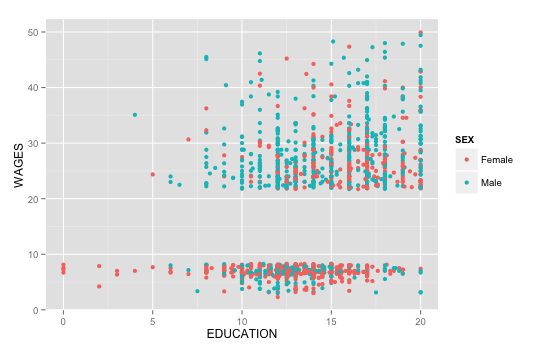
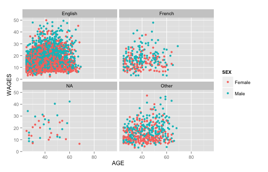

## Step 1: Load CSV File into Oracle:

**Code:**
```{r, eval=FALSE}
require(tidyr)
require(dplyr)
require(ggplot2)

setwd("~/Desktop/College Notes/Fall 2015/DataVisualization/Project 2/01 Data")

file_path <- "SLID.csv"

measures <- c("row_no","wages","education","age")

# Get rid of special characters in each column.
for(n in names(df)) {
  df[n] <- data.frame(lapply(df[n], gsub, pattern="[^ -~]",replacement= ""))
}

dimensions <- setdiff(names(df), measures)
if( length(measures) > 1 || ! is.na(dimensions)) {
  for(d in dimensions) {
    # Get rid of " and ' in dimensions.
    df[d] <- data.frame(lapply(df[d], gsub, pattern="[\"']",replacement= ""))
    # Change & to and in dimensions.
    df[d] <- data.frame(lapply(df[d], gsub, pattern="&",replacement= " and "))
    # Change : to ; in dimensions.
    df[d] <- data.frame(lapply(df[d], gsub, pattern=":",replacement= ";"))
  }
}

# Get rid of all characters in measures except for numbers, the - sign, and period.dimensions
if( length(measures) > 1 || ! is.na(measures)) {
  for(m in measures) {
    df[m] <- data.frame(lapply(df[m], gsub, pattern="[^--.0-9]",replacement= ""))
  }
}

write.csv(df, paste(gsub(".csv", "", file_path), ".reformatted.csv", sep=""), row.names=FALSE, na = "")

tableName <- gsub(" +", "_", gsub("[^A-z, 0-9, ]", "", gsub(".csv", "", file_path)))
sql <- paste("CREATE TABLE", tableName, "(\n-- Survey of Labour and Income Dynamics\n")
if( length(measures) > 1 || ! is.na(dimensions)) {
  for(d in dimensions) {
    sql <- paste(sql, paste(d, "varchar2(4000),\n"))
  }
}
if( length(measures) > 1 || ! is.na(measures)) {
  for(m in measures) {
    if(m != tail(measures, n=1)) sql <- paste(sql, paste(m, "number(38,4),\n"))
    else sql <- paste(sql, paste(m, "number(38,4)\n"))
  }
}
sql <- paste(sql, ");")
cat(sql)
```

## Step 2: Modify query, name datafile "SLID"

**Code**
```{r, eval=FALSE}
require("jsonlite")
require("RCurl")
require(tidyr)
require(dplyr)
require(ggplot2)

SLID <- data.frame(fromJSON(getURL(URLencode('129.152.144.84:5001/rest/native/?query="select * from SLID"'),httpheader=c(DB='jdbc:oracle:thin:@129.152.144.84:1521/PDBF15DV.usuniversi01134.oraclecloud.internal', USER='cs329e_jso464', PASS='orcl_jso464', MODE='native_mode', MODEL='model', returnDimensions = 'False', returnFor = 'JSON'), verbose = TRUE), ))
```

## Step 3: Data Wrangling & Plot 1
* In the data we found that the bottom 20% of wages was composed of more women than men and the top 20% was composed of more men than women. This indicates that men who have more years of education tend to have higher wages than women who have more years of education. Hence, this data suggests that more education is more beneficial to men than women.



**Steps:**
1. We created a new column called "WAGES_PERCENT" that distributed the wages on a scale from zero to 1
2. We took out WAGES and EDUCATION that had a null value
3. We wanted to only find survey respondents who were at the bottom 20% and top 20% in terms of wages
4. We put x axis as education, y axis as wages, and legend as sex
5. Graphed the data

**Code:**
```{r, eval=FALSE}
SLID %>% mutate(WAGES_PERCENT = cume_dist(WAGES)) %>% filter(!is.na(WAGES), !is.na(EDUCATION), WAGES_PERCENT <= .20 | WAGES_PERCENT >= .80) %>% ggplot(aes(x = EDUCATION, y = WAGES)) + geom_point(aes(color=SEX))
```

## Step 4: Data Wrangling & Plot 2
* We found that the respondents with the most years of education were young (<50) and english-speaking. On the other hand, older (>50), non english-speaking respondents generally had fewer years of education. This could imply that education became more important to the newer generations. There is also a high correlation of education and ability to speak english.


**Steps:**
1. We selected age, education, and language from the table
2. We filtered out all the null values in age and education
3. We only wanted survey respondents who could speak English, French or Other. There were some data that had language as null so this filter removed that from our analysis
4. We put x axis as education, y axis as wages, and legend as sex
5. Graphed the data

**Code:**
```{r, eval=FALSE}
SLID %>% select (AGE, EDUCATION, LANGUAGE) %>% filter(!is.na(AGE), !is.na(EDUCATION), LANGUAGE %in% c("English", "French", "Other")) %>% ggplot(aes(x = AGE, y = EDUCATION)) + geom_point(aes(color = LANGUAGE))
```

## Step 5: Data Wrangling & Plot 3
* We found out that our data perhaps may be skewed since most of the respondents are English speakers. The data represents labor statistics for people in Canada. By doing these data visualizations we did find that people under 60 years old tend to make between $10 - $20 an hour, since this area of the graphs are very clustered together particularly in the graph for English speakers. 



**Steps:**
1. We grouped our data by language, wages, and sex
2. We wanted data for people ages 25 years and older so we set a filter for ages 25 and older
3. We set the x axis as age, y axis as wage, and legend as sex
4. We set the facet_wrap as language because we wanted to compare the earning power of people based on language
5. Graphed the data

**Code:**
```{r, eval=FALSE}
SLID %>% group_by(WAGES,LANGUAGE,SEX) %>% filter(AGE >= 25) %>% ggplot(aes(x=AGE, y=WAGES, color=SEX)) + geom_point() + facet_wrap(~LANGUAGE)
```


## Head and Summary

```{r, echo=FALSE}
require("jsonlite")
require("RCurl")

SLID <- data.frame(fromJSON(getURL(URLencode('129.152.144.84:5001/rest/native/?query="select * from SLID"'),httpheader=c(DB='jdbc:oracle:thin:@129.152.144.84:1521/PDBF15DV.usuniversi01134.oraclecloud.internal', USER='cs329e_jso464', PASS='orcl_jso464', MODE='native_mode', MODEL='model', returnDimensions = 'False', returnFor = 'JSON'), verbose = TRUE), ))

summary(SLID)
head(SLID)
```
